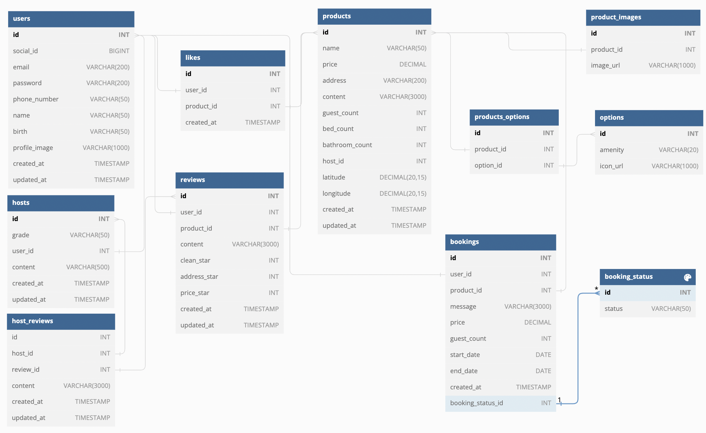

# o2bnb


## 📖 DESCRIPTION

- o2bnb는 서울 내 호텔 예약 플랫폼입니다.
- airbnb를 모티브로 하여, 서울 방문객만을 위한 호텔 전용 플랫폼을 기획하여 프로젝트를 진행했습니다.
- 개발 기간과 DB 작업을 감안하여 서울 주요 지역(6개구)을 선정하여 해당 지역 내 호텔에 대해 서비스를 제공합니다.
- 소셜 로그인, 호텔 검색, 지도 API, 리뷰 조회, 위시리스트 관리, 예약 및 결제 요청 등을 구현했습니다.
- 스크럼 방식에 따라 주별 스프린트 미팅과 데일리 스크럼 미팅을 통해 프로젝트를 진행하였으며, 1차 프로젝트 경험을 토대로 발표 전 충분한 검토 시간 확보를 위해 일정 관리에 특히 신경썼습니다.

### BASIC INFORMATION

- 개발 기간: 2022.10.04 ~ 2022.10.14
- 개발 인원: 7명(FE 4명, BE 3명)
- ERD
  
- API Documentation: https://docs.google.com/spreadsheets/d/1e1eAj5qsqIzI3Xe0H3Evob1awvPJrAPKPtYo17kIk4Q/edit#gid=0

### FOLDER STRUCTURE

```
├── README.md
├── app.js
├── db
│   ├── migrations
│   │   ├── 20221004072425_users.sql
│   │   ├── 20221004072455_hosts.sql
│   │   ├── 20221004072516_products.sql
│   │   ├── 20221004072537_options.sql
│   │   ├── 20221004072548_reviews.sql
│   │   ├── 20221004072554_host_reviews.sql
│   │   ├── 20221004072609_product_images.sql
│   │   ├── 20221004072613_likes.sql
│   │   ├── 20221004072620_booking_status.sql
│   │   ├── 20221004072624_bookings.sql
│   │   ├── 20221004103305_chatting.sql
│   │   └── 20221005061833_products_options.sql
│   └── schema.sql
├── env_sample
├── img
│   ├── bookandreview.png
│   ├── erd.png
│   ├── main.png
│   ├── paymentcomplete.png
│   └── requestpayment.png
├── package-lock.json
├── package.json
├── pull_request_template.md
├── server.js
├── src
│   ├── controllers
│   │   ├── bookController.js
│   │   ├── hostController.js
│   │   ├── index.js
│   │   ├── likeController.js
│   │   ├── productController.js
│   │   ├── reviewController.js
│   │   └── userController.js
│   ├── models
│   │   ├── bookDao.js
│   │   ├── dataSource.js
│   │   ├── hostDao.js
│   │   ├── index.js
│   │   ├── likeDao.js
│   │   ├── productDao.js
│   │   ├── reviewDao.js
│   │   └── userDao.js
│   ├── routers
│   │   ├── bookRouter.js
│   │   ├── hostRouter.js
│   │   ├── index.js
│   │   ├── likeRouter.js
│   │   ├── productRouter.js
│   │   ├── reviewRouter.js
│   │   └── userRouter.js
│   ├── services
│   │   ├── bookService.js
│   │   ├── hostService.js
│   │   ├── index.js
│   │   ├── likeService.js
│   │   ├── productService.js
│   │   ├── reviewService.js
│   │   └── userService.js
│   └── utils
│       ├── auth.js
│       └── error.js
├── tests
    ├── review.test.js
    └── user.test.js
```

### TECH STACK

- Server: Javascript, Node.js, Express
- Database: MySQL, TypeORM
- DevOps: AWS-EC2, AWS-RDS
- Tools: dbdiagram, Git, GitHub, Trello, Slack, Google Sheets

## ⌨️ FUNCTIONS

### 소셜 로그인

- 사용자 접근성을 고려하여 OAuth 2.0을 적용한 소셜 로그인 구현 (Kakao)

### 상품 검색

- 필터를 활용한 호텔 검색 기능 (지역별, 가격대별, 옵션 등)

### 상품 조회

- 외부 지도 API 호출을 통한 호텔 위치 조회 기능
- 상품별 소개, 호스트 정보 조회 기능
- 상품별 리뷰 정보 조회 및 별점 계산 기능

### 위시리스트

- 위시리스트 추가, 조회, 삭제 API

### 예약 및 결제 요청

- 상품별 예약 요청 기능
- 예약 상태에 따른 결제 요청 기능
- 예약 완료 후 예약 정보 조회 기능

## 👥 TEAMMATES

- FrontEnd: 김대호, 김효성, 남장현, 이윤승
- BackEnd: 이경은, 정다영, 최진우

## ⚠️ LICENSE

- 이 프로젝트는 'airbnb' 홈페이지를 참고하여 학습 목적으로 제작되었기 때문에 이 코드를 활용하여 이득을 취하거나 무단 배포할 경우 법적으로 문제가 될 수 있습니다.
- 이 프로젝트에서 사용하고 있는 사진은 무료 배포된 자료임을 참고하시기 바랍니다.

## 📱 CONTACT

최진우
choiramsey8@gmail.com | https://velog.io/@choiramsey8
